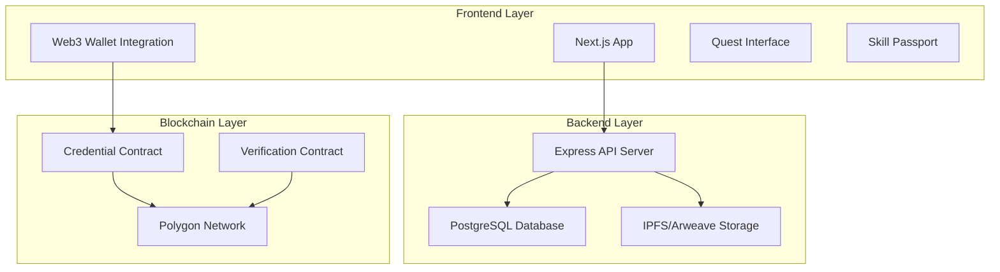

# SkillChain Platform Design Document

## Overview

SkillChain is a full-stack Web3 learning platform consisting of a React frontend, Node.js backend, and Solidity smart contracts deployed on Polygon. The architecture follows a modular design with clear separation between the web application layer, API layer, and blockchain layer.

The platform implements a "Proof-of-Learning" flow where users complete educational quests, earn blockchain-verified credentials as soulbound tokens, and maintain a verifiable skill passport.

## Architecture

### High-Level Architecture



### Technology Stack

**Frontend:**
- Next.js 14 with App Router
- TailwindCSS for styling
- Ethers.js v6 for blockchain interaction
- WalletConnect v2 and MetaMask SDK
- React Query for state management

**Backend:**
- Node.js with Express.js
- PostgreSQL with Prisma ORM
- IPFS via Pinata for metadata storage
- JWT for session management
- Rate limiting with Redis

**Smart Contracts:**
- Solidity 0.8.19
- OpenZeppelin contracts for security
- Hardhat for development and testing
- Polygon Mumbai testnet for deployment

## Components and Interfaces

### Frontend Components

#### Authentication System
- **WalletConnector**: Handles multiple wallet providers (MetaMask, WalletConnect)
- **AuthProvider**: React context for authentication state
- **ProtectedRoute**: Route wrapper for authenticated pages

#### Quest Management
- **QuestDashboard**: Displays available quests with filtering
- **QuestDetail**: Shows quest information and requirements
- **ChallengeRenderer**: Dynamic component for different challenge types
- **ProgressTracker**: Visual progress indicators

#### Skill Passport
- **CredentialCard**: Individual credential display component
- **PassportView**: Grid layout of all user credentials
- **ShareProfile**: Public profile sharing functionality
- **VerificationBadge**: On-chain verification status

### Backend API Endpoints

#### Authentication Routes
```
POST /api/auth/nonce - Generate nonce for wallet signature
POST /api/auth/verify - Verify wallet signature and create session
POST /api/auth/logout - Invalidate session
GET /api/auth/profile - Get user profile
```

#### Quest Management Routes
```
GET /api/quests - List available quests
GET /api/quests/:id - Get quest details
POST /api/quests/:id/enroll - Enroll in quest
PUT /api/quests/:id/progress - Update quest progress
POST /api/quests/:id/complete - Complete quest
```

#### Credential Routes
```
GET /api/credentials - Get user credentials
POST /api/credentials/mint - Mint new credential
GET /api/credentials/:id/verify - Verify credential
GET /api/credentials/public/:address - Public credential view
```

#### Admin Routes
```
POST /api/admin/quests - Create new quest
PUT /api/admin/quests/:id - Update quest
DELETE /api/admin/quests/:id - Delete quest
GET /api/admin/analytics - Platform analytics
```

### Smart Contract Interfaces

#### SkillChainCredential Contract
```solidity
interface ISkillChainCredential {
    function mintCredential(
        address to,
        string memory tokenURI,
        bytes32 questId
    ) external returns (uint256);
    
    function getCredentialsByOwner(address owner) 
        external view returns (uint256[] memory);
    
    function getCredentialMetadata(uint256 tokenId) 
        external view returns (string memory);
    
    function isCredentialValid(uint256 tokenId) 
        external view returns (bool);
}
```

#### SkillChainVerification Contract
```solidity
interface ISkillChainVerification {
    function verifyCredential(
        address owner,
        uint256 tokenId
    ) external view returns (bool, string memory, uint256);
    
    function getIssuerInfo(uint256 tokenId) 
        external view returns (address, string memory);
    
    function revokeCredential(uint256 tokenId) external;
}
```

## Data Models

### Database Schema

#### Users Table
```sql
CREATE TABLE users (
    id UUID PRIMARY KEY DEFAULT gen_random_uuid(),
    wallet_address VARCHAR(42) UNIQUE NOT NULL,
    username VARCHAR(50),
    email VARCHAR(255),
    profile_image_url TEXT,
    reputation_score INTEGER DEFAULT 0,
    created_at TIMESTAMP DEFAULT NOW(),
    updated_at TIMESTAMP DEFAULT NOW()
);
```

#### Quests Table
```sql
CREATE TABLE quests (
    id UUID PRIMARY KEY DEFAULT gen_random_uuid(),
    title VARCHAR(255) NOT NULL,
    description TEXT,
    difficulty_level VARCHAR(20),
    estimated_duration INTEGER, -- in minutes
    reward_points INTEGER,
    is_active BOOLEAN DEFAULT true,
    metadata JSONB,
    created_at TIMESTAMP DEFAULT NOW(),
    updated_at TIMESTAMP DEFAULT NOW()
);
```

#### User Quest Progress Table
```sql
CREATE TABLE user_quest_progress (
    id UUID PRIMARY KEY DEFAULT gen_random_uuid(),
    user_id UUID REFERENCES users(id),
    quest_id UUID REFERENCES quests(id),
    status VARCHAR(20) DEFAULT 'enrolled',
    progress_data JSONB,
    completed_at TIMESTAMP,
    created_at TIMESTAMP DEFAULT NOW(),
    updated_at TIMESTAMP DEFAULT NOW()
);
```

#### Credentials Table
```sql
CREATE TABLE credentials (
    id UUID PRIMARY KEY DEFAULT gen_random_uuid(),
    user_id UUID REFERENCES users(id),
    quest_id UUID REFERENCES quests(id),
    token_id BIGINT UNIQUE,
    contract_address VARCHAR(42),
    metadata_uri TEXT,
    transaction_hash VARCHAR(66),
    issued_at TIMESTAMP DEFAULT NOW()
);
```

### IPFS Metadata Schema

#### Credential Metadata
```json
{
    "name": "JavaScript Fundamentals Completion",
    "description": "Successfully completed the JavaScript Fundamentals quest",
    "image": "ipfs://QmCredentialBadgeImage",
    "attributes": [
        {
            "trait_type": "Quest",
            "value": "JavaScript Fundamentals"
        },
        {
            "trait_type": "Difficulty",
            "value": "Beginner"
        },
        {
            "trait_type": "Completion Date",
            "value": "2024-01-15"
        },
        {
            "trait_type": "Score",
            "value": "95"
        }
    ],
    "external_url": "https://skillchain.app/credentials/123",
    "skillchain_metadata": {
        "questId": "uuid-here",
        "issuer": "SkillChain Platform",
        "verificationContract": "0x...",
        "proofOfLearning": {
            "challenges_completed": 5,
            "total_time_spent": 180,
            "final_score": 95
        }
    }
}
```

## Error Handling

### Frontend Error Handling
- **Wallet Connection Errors**: Graceful fallback with clear user messaging
- **Network Errors**: Retry mechanisms with exponential backoff
- **Transaction Failures**: User-friendly error messages with suggested actions
- **Loading States**: Skeleton screens and progress indicators

### Backend Error Handling
- **API Error Responses**: Standardized error format with error codes
- **Database Errors**: Connection pooling and retry logic
- **Blockchain Errors**: Gas estimation and transaction monitoring
- **Rate Limiting**: Clear messaging about limits and retry timing

### Smart Contract Error Handling
- **Access Control**: Custom error messages for unauthorized access
- **Input Validation**: Require statements with descriptive messages
- **Emergency Pause**: Circuit breaker pattern for critical issues
- **Upgrade Safety**: Proxy pattern with initialization checks

## Testing Strategy

### Frontend Testing
- **Unit Tests**: Jest and React Testing Library for components
- **Integration Tests**: Cypress for user flows
- **Wallet Testing**: Mock wallet providers for consistent testing
- **Responsive Testing**: Cross-device and browser compatibility

### Backend Testing
- **Unit Tests**: Jest for individual functions and middleware
- **Integration Tests**: Supertest for API endpoint testing
- **Database Tests**: Test database with seed data
- **Contract Integration**: Local blockchain testing with Hardhat

### Smart Contract Testing
- **Unit Tests**: Hardhat with Waffle for contract functions
- **Integration Tests**: Full deployment and interaction testing
- **Security Tests**: Slither static analysis and manual review
- **Gas Optimization**: Gas usage profiling and optimization

### End-to-End Testing
- **User Journey Tests**: Complete flows from quest enrollment to credential verification
- **Cross-Platform Tests**: Web and mobile wallet integration
- **Performance Tests**: Load testing for concurrent users
- **Security Tests**: Penetration testing and vulnerability assessment

## Security Considerations

### Authentication Security
- **Signature Verification**: Proper nonce handling and signature validation
- **Session Management**: Secure JWT tokens with appropriate expiration
- **Rate Limiting**: Protection against brute force and spam attacks

### Smart Contract Security
- **Access Controls**: Role-based permissions with OpenZeppelin AccessControl
- **Reentrancy Protection**: ReentrancyGuard for state-changing functions
- **Integer Overflow**: SafeMath or Solidity 0.8+ built-in protection
- **Upgrade Safety**: Transparent proxy pattern with proper initialization

### Data Security
- **Input Validation**: Comprehensive validation on all user inputs
- **SQL Injection**: Parameterized queries with Prisma ORM
- **XSS Protection**: Content Security Policy and input sanitization
- **CORS Configuration**: Proper cross-origin resource sharing setup

## Performance Optimization

### Frontend Optimization
- **Code Splitting**: Dynamic imports for route-based splitting
- **Image Optimization**: Next.js Image component with WebP support
- **Caching**: React Query for API response caching
- **Bundle Analysis**: Regular bundle size monitoring and optimization

### Backend Optimization
- **Database Indexing**: Proper indexes on frequently queried columns
- **Connection Pooling**: Efficient database connection management
- **Caching Layer**: Redis for frequently accessed data
- **API Rate Limiting**: Prevent abuse and ensure fair usage

### Blockchain Optimization
- **Gas Optimization**: Efficient contract code and batch operations
- **Transaction Batching**: Group multiple operations when possible
- **Event Indexing**: Proper event emission for efficient querying
- **Network Selection**: Polygon for lower costs and faster transactions